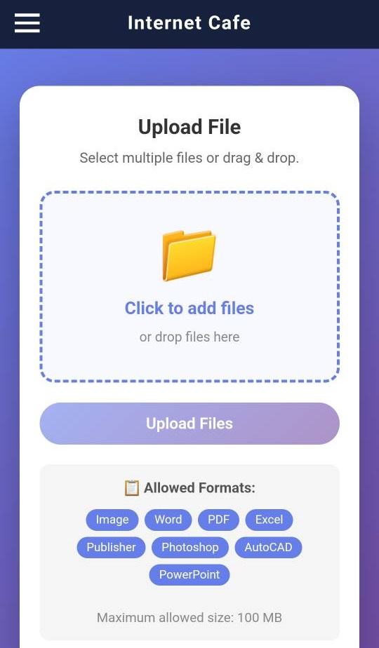
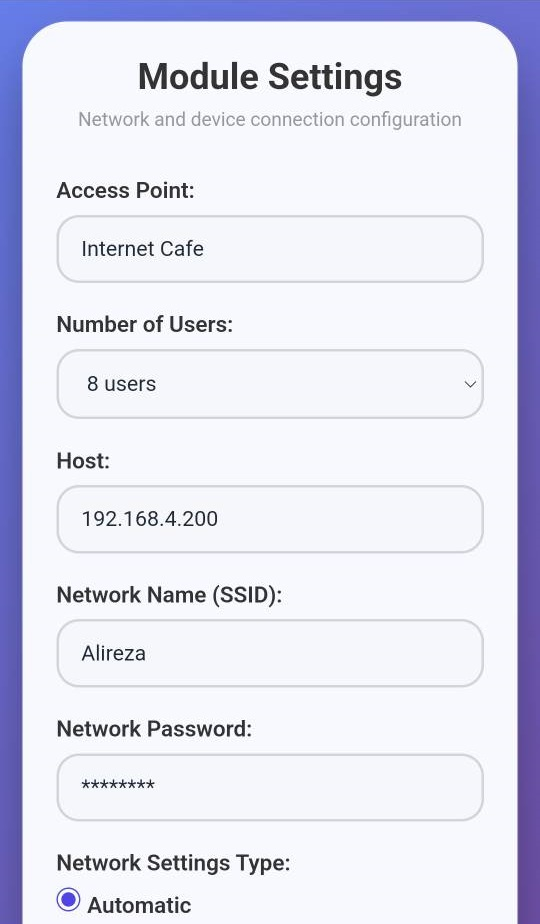

# 📡 ESP32 Internet Cafe Middleware

**Turn your ESP32 into a high-speed, internet-free file transfer hotspot for cyber cafes**

---

## 📸 System Preview

  <table>
    <tr>
      <td align="center"></td>
      <td align="center"></td>
    </tr>
  </table>

---

## 🧠 Overview

**ESP32 Internet Cafe Middleware** is a middleware that converts your ESP32 module into a file transfer access point for Internet cafe systems without needing internet, with speeds faster than Bluetooth.

It uses a communication protocol similar to Zapya or SHAREit, but powered by **Apache PHP** running on the cafe manager's system.

The ESP32's job is to establish communication between the customer and the cafe manager's system for file transfer.

After setting up this middleware, it creates an access point named **"Internet Cafe"** - open network with no password so that everyone can easily connect and send files. After connecting to the module's access point, simply enter an address like **file.com** in their browser to be redirected to the file transfer page.

This middleware supports Persian, Arabic, and English languages.

---

## ⚙️ Admin Settings

To access the module settings page, type the following address in your browser:

👉 **http://192.168.4.1/en/login/**

| Field | Default Value |
|-------|---------------|
| Username | admin |
| Password | admin |

> ⚠️ **Important:** Change the default password after your first login!

---

## 🚀 Usage Guide

### Connect to the Access Point

| Setting | Value |
|---------|-------|
| SSID | Internet Cafe |
| Password | (none - open network) |

### Access File Transfer Page

After connecting to the ESP32 access point, simply type in your browser:

👉 **http://file.com**

You will be redirected to the file transfer page.

---

## 🌍 Language Support

| Language | Direction | Status |
|----------|-----------|--------|
| Persian (فارسی) | RTL | ✅ Full support |
| Arabic (العربية) | RTL | ✅ Full support |
| English | LTR | ✅ Full support |

---

## 📄 License

This project is licensed under the MIT License - see the LICENSE file for details.

---

**Built with ❤️ using ESP32 + Apache PHP — High-speed file transfer for modern cyber cafes**

